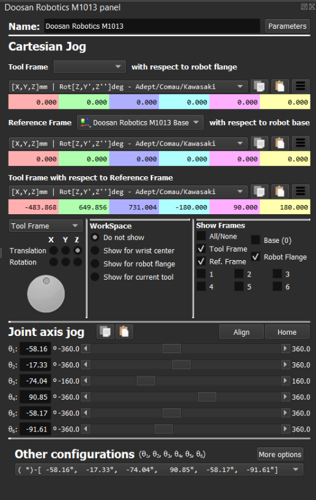
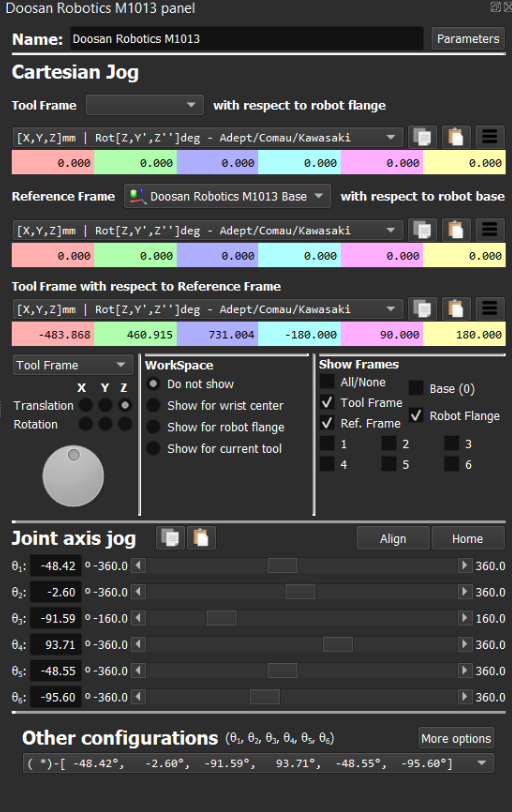
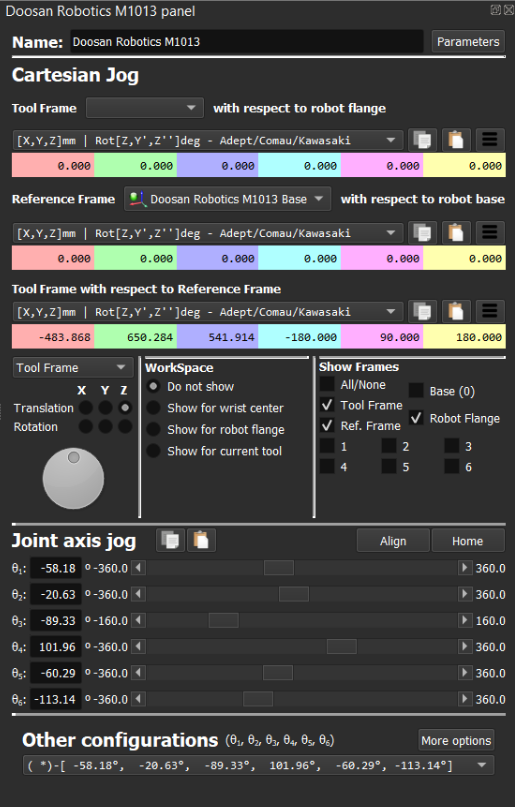
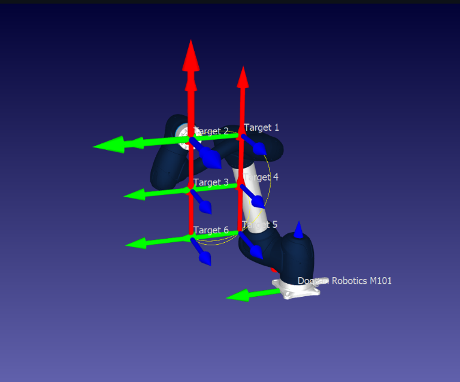
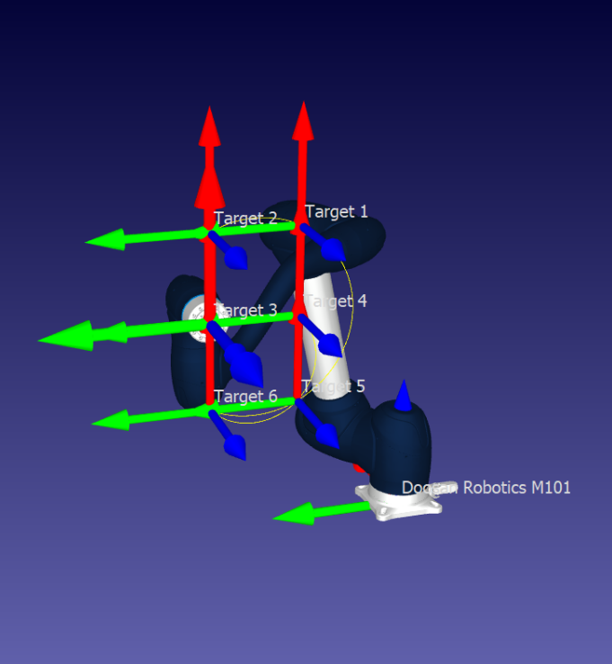
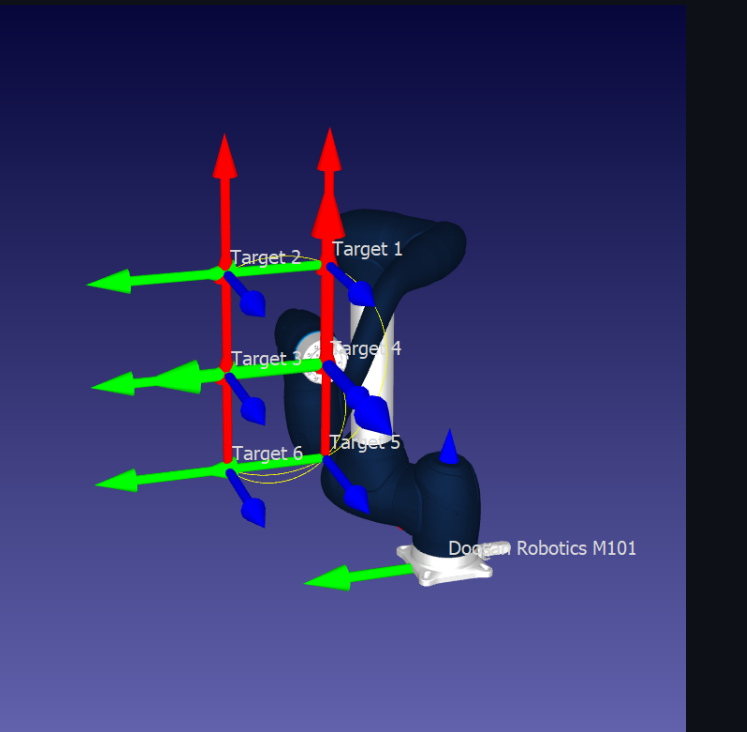

## -EXPERIMENT--01-Spatial-Descriptions-using-Robo-DK

### AIM: To understand the Robot DK software for spatial descriptions 

### SOFTWARE REQUIRED : ROBO DK Version 5.4

 ## THEORY
 
 ###  New project
Follow these steps to create a new RoboDK project (RDK station):
1.	Download and install RoboDK from the website: https://robodk.com/download
2.	Double click the shortcut on the Desktop  
3.	If other stations are open:
select File   New Station (Ctrl+N) to start a new project

Multiple RoboDK projects can be open at the same time. Double clicking the Station icon   in the tree will activate and display that project.
 ### PROCEDURE :
### Select a robot
New robots can be added from a local drive or from the online library:
1.	Select File  Open online library (Ctrl+Shift+O). A new nested window will appear showing the online library
It is also possible to select the corresponding button in the toolbar.  
2.	Use the filters to find your robot by brand, payload, ...
In this example, we will use a UR10 robot (10 kg payload robot and 1.3 m reach).
3.	Select Download. The robot should automatically appear in the station in a few seconds.
4.	The online library can be closed once the robot is loaded
Tip: Selecting reset filter in the online library will remove any filter that was use
Tip: Alternatively, it is also possible to download the robot files (.robot extension) separately, from the website: http://robodk.com/library and open them in RoboDK by drag & dropping the file to the main window or by selecting FileOpen.
Note: Every time a new robot is loaded in RoboDK, a new reference frame is added representing the robot base frame.
Note: Loading robots from the online library will store them in the local library. The default location of this folder is: C:/RoboDK/Library/.


### FIGURE -01
### Add a Reference Frame
A Reference frame allows placing objects with respect to a robot or with respect to other objects in the 3D space (including position and orientation).
Note: More information about reference frames in RoboDK in the reference frames section. To add a new reference frame:
1.	Select Program  Add Reference Frame
Alternatively, select the equivalent button in the toolbar
2.	Double click the reference frame (on the tree or on the 3D geometry on the main screen) to enter the coordinates shown in the image (X,Y,Z position and Euler angles for the orientation). The mouse wheel can be used on top of each case to quickly update the position of the reference frame on the main screen.
The following colors are used by default:
o	X coordinate  Red
o	Y coordinate  Green
o	Z coordinate  Blue
o	1st Euler rotation  Cyan
o	2nd Euler rotation  Magenta
o	3rd Euler rotation  Yellow
Tip: Select Tools>Options>Display>Display XYZ axis letters to see the Coordinate system axes.
3.	Select ViewMake reference frames bigger (+) to increase the size of the reference frames
4.	Select ViewMake reference frames smaller (-) to decrease the size of the reference frames
5.	Select ViewShow/Hide text on screen (/) to show or hide the text on the screen
6.	Optionally, rename any reference frame or object in the tree by selecting F2

### FIGURE -02
If more than one reference frame is used, it is possible to drag and drop them inside the Station Tree to match the dependency that exists in the real setup. For example, the reference Frame 2 may be placed with respect to the robot base reference. In this case, if the UR10 Base reference is moved, the Frame 2 is also moved with it. It is important to consider this if other robots or reference frames are used. The next image shows the difference in dependency.

### FIGURE -03

Even if the dependency is different, it is still possible to enter or retrieve the coordinates of any reference frame with respect to any other reference frame, as shown in the next image. Most robot controllers require the coordinates of the reference frame with respect to the robot base frame.


### FIGURE-04
Reference frames can also be moved in the main screen by holding the Alt key, or selecting the corresponding button in the toolbar  . Then, drag the reference with the mouse on the screen. As the reference is being moved, the corresponding coordinate values will be updated.


### FIGURE-05

RoboDK supports most standard 3D formats such as STL, STEP (or STP) and IGES (or IGS) formats. Other formats such as WRML, 3DS or OBJ are also supported (STEP and IGES are not supported on Mac and Linux versions). To load a new 3D file:

### Create Targets
Robot positions are recorded as Targets. Follow these steps to create two targets as a new home target and approach target respectively:
1.	Double click the robot to show the robot panel
2.	Select Paint gun as the Tool Frame. Once a tool or a reference frame becomes active it will show a green dot.
3.	Select Frame 2 as the Reference Frame
4.	Hold the Alt key and move the robot by dragging it through the TCP or the robot flange to a safe position, free of collisions with any objects. Alternatively, move the coordinates of the Tool Frame (TCP) with respect to the reference Frame.
5.	Use the Other configurations section to switch between different robot configurations and make sure that none of the robot axes are close to the axis limits.
Tip: In general, it is better if the first target of a program has the joint axes as centered as possible (the joint sliders are as centered as possible, as shown in the following image). This makes sure that the robot won’t reach the axis limits as it follows linear moves along the program. This is possible by changing the robot configuration.
6.	Select Program  Teach Target (Ctrl+T), or the corresponding button in the toolbar (as shown in the image). The target will be placed as a dependency of the active reference frame and will automatically remember the current robot position (cartesian and joints axes).
In this example, the robot joint coordinates used for the first target are: [-150, -75, -90, -60, 70, 110] deg. These values can be copied from this text and     pasted in the Joint axis jog of the robot panel using the corresponding button.


### FIGURE-06
7.	Rename the first target as Home by pressing F2. Alternatively, select ToolsRename item.
8.	Move the robot closer to one edge of the part (by dragging the tool using the Alt key, entering coordinates or jogging the axis manually)
In this example we used the following robot joint coordinates [0,0,200,180,0,180] deg.
9.	Select Program  Teach Target (Ctrl+T) or the appropriate button in the toolbar to create a new target
10.	Rename the target to Approach as shown in step 7
11.	Select the Home target and the Approach target alternatively to see the robot moving between the two targets
12.	Right click the target and select Teach Current Position (Alt+double click) if a different position needs to be recorded for one of the targets
13.	Right click the target and select   Target Options… (F3) to open the target options window shown in the next image


### FIGURE -07


### PROGRAM :
```
def Prog1():
  
  #--------------------------
  # Add your default header and subprograms here
  # For example, to drive a gripper as a program call:
  # def Gripper_Open():
  #   set_digital_output(3, 1)
  #
  # def Gripper_Close():
  #   set_digital_output(3, 0)
  #
  # Example to drive a spray gun:
  def SprayOn(value):
    # use the value as an output:
    DO_SPRAY = 5
    if value == 0:
      set_digital_output(DO_SPRAY, 0)
    else:
      set_digital_output(DO_SPRAY, 1)

  #--------------------------
  
  
  # Main program:
  # Program generated by RoboDK v5.4.1 for Doosan Robotics M1013 on 12/05/2022 18:43:09
  # Using nominal kinematics.
  set_ref_coord(set_user_cart_coord(posx(0.000,0.000,0.000,0.0000,0.0000,0.0000),ref=DR_BASE))
  movec(posx(-483.868,460.508,921.291,-180.0000,90.0000,180.0000),posx(-483.868,649.856,921.291,-180.0000,90.0000,180.0000))
  movel(posx(-483.868,649.856,731.004,-180.0000,90.0000,180.0000))
  movel(posx(-483.868,460.915,731.004,-180.0000,90.0000,180.0000))
  movec(posx(-483.868,460.915,541.914,-180.0000,90.0000,180.0000),posx(-483.868,650.284,541.914,-180.0000,90.0000,180.0000))
  # End of main program
  
Prog1()
```

### COORDINATES OF THE MOVEMENTS: 







### SIMULATION RESULTS :





